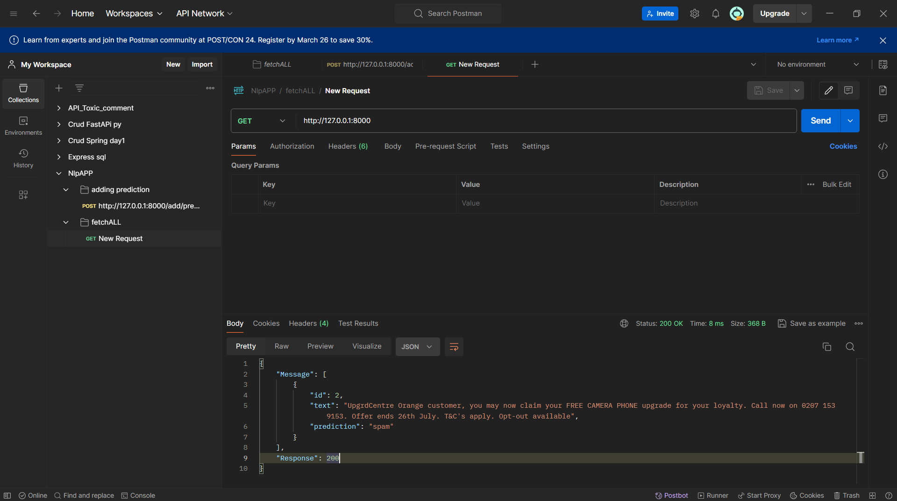

# nlpML
My dummy App for habit in code with python, I created with dataset in Kaggle to classify in sentiment to Spam or Not-spam

you can clone my app if you want

	<strong>requirement</strong>
 
My dummy App for habit in code with python, I created with dataset in Kaggle to classify in sentiment to Spam or Not-spam

	<code>python -m yourvenv</code>
	<code>pip install -r requirements.txt</code>

[how to use venv] (https://docs.python.org/3/library/venv.html)

- result  
